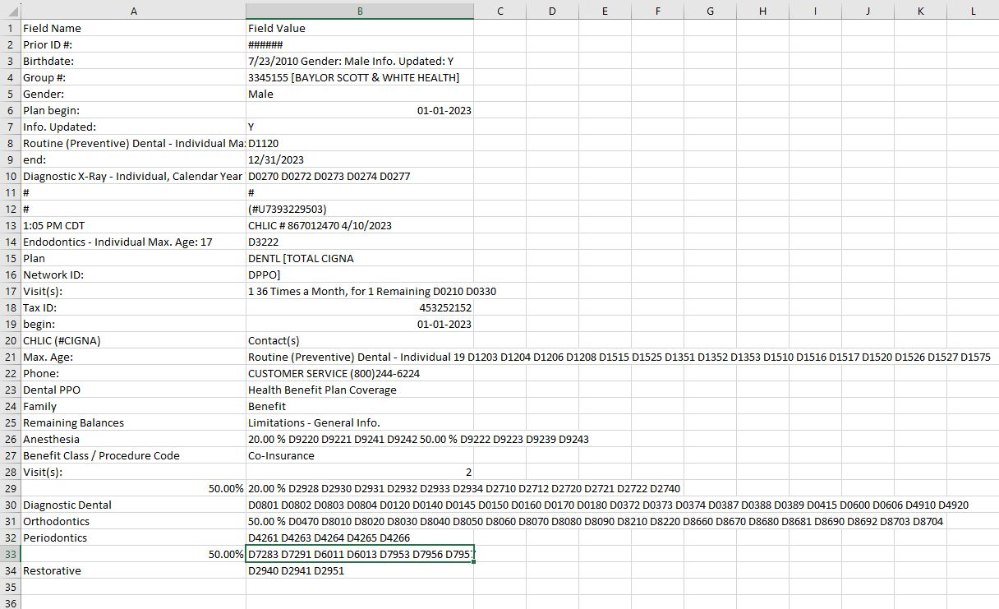

# Robot Framework Insurance Information Extraction and PDF Filling

[](https://travis-ci.org/your-username/your-repo)
[](https://opensource.org/licenses/MIT)

This project utilizes Robot Framework to extract insurance information from the web, analyze and perform calculations through the robot and and fill clinic softwares and billing PDFs automatically.
An insurance claim is done end to end in this project entirely without human intervention.

## Features

- Web scraping to extract insurance information
- PDF manipulation to fill dentist forms
- Easy-to-use Robot Framework keywords
- Customizable test cases and test data

##Screenshots
The project utilises Robot Framewoek, Google Document AI APIs. 
1.
To extract text contents from HTML tables and iterate over them in Robocorp, you can use the "Robot Framework Browser" library along with the "Robot Framework Selenium Library".
In this example, the table is located using an XPath expression and stored in the ${table} variable. The outer loop iterates over each row in the table, and the inner loop iterates over each cell in the row. The text content of each cell is logged to the console using the "Log" keyword.

The extracted keywords are saved in an excel file


## Installation

1. Clone the repository:

```bash
   git clone https://github.com/your-username/your-repo.git


# Template: Standard Robot Framework

This is the simplest template to start from.

- Get started from a simple task template in `tasks.robot`.
  - Uses [Robot Framework](https://robocorp.com/docs/languages-and-frameworks/robot-framework/basics) syntax.
- You can configure your robot `robot.yaml`.
- You can configure dependencies in `conda.yaml`.

## Learning materials

- [Robocorp Developer Training Courses](https://robocorp.com/docs/courses)
- [Documentation links on Robot Framework](https://robocorp.com/docs/languages-and-frameworks/robot-framework)
- [Example bots in Robocorp Portal](https://robocorp.com/portal)
